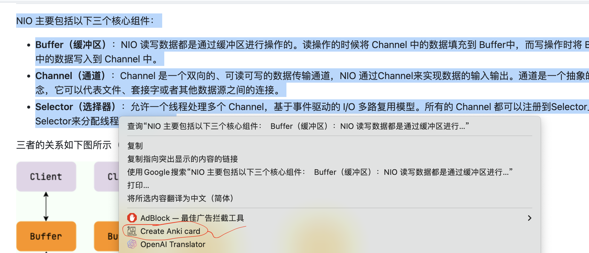
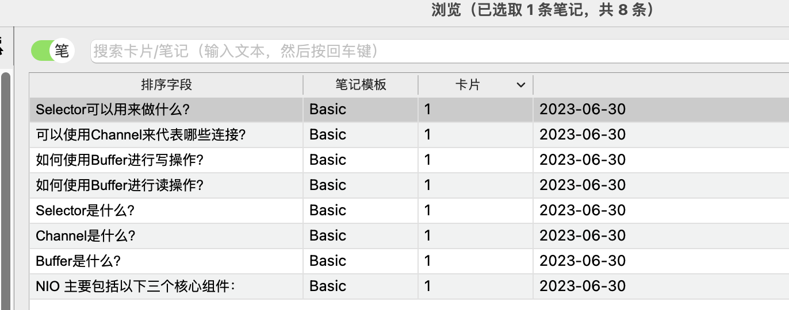

# Anki card createor

通过chatgpt创建anki card

这个项目的出发点: 

1. 在网上冲浪的时候，有价值的碎片信息，收集一下，用chatgpt整理成anki卡片
2. 考证 / 面试背八股文

## 如何使用

1. 安装chrome extension, 通过zip包安装：  [下载地址](https://github.com/mggger/chatgpt-anki-chrome-extension/files/11913090/v0.1.zip) 

2. 配置相关配置,  并保存

   

3. 当遇到感兴趣知识点的时候，选中文本， 通过chatgpt总结成anki卡片

4. 完成后，可以在anki里面开始背诵了

   

   

